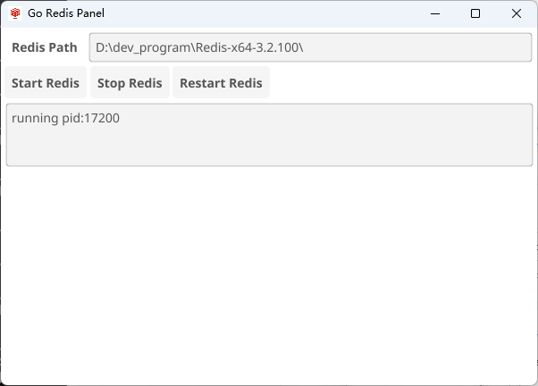

# Go Redis Panel

Go Redis Panel is a simple Graphical User Interface (GUI) application for managing the start, stop, and restart of Redis services. This program is written in Go and uses the Fyne library to create the GUI.


## Features

- Start Redis service
- Stop Redis service
- Restart Redis service
- Display Process ID (PID) of the running Redis service

## Installation

To use this program, you need to have the Go environment installed locally. Visit the [Go official website](https://golang.org) for installation guidelines.

Once Go is installed, you can clone and build the project with the following commands:

```bash
git clone https://github.com/litongjava/go-redis-panel.git
cd go-redis-panel
go build -ldflags -H=windowsgui
```

This will generate an executable file without a console window.

## Usage

After starting the program, you will see a window that includes:

- **Redis Path**: A text box to specify the installation path of the Redis service.
- **Start Redis**: A button to click in order to start the Redis service.
- **Stop Redis**: A button to click in order to stop the currently running Redis service.
- **Restart Redis**: A button to click in order to restart the Redis service.

The Process ID (PID) of the service will be displayed in the text area at the bottom when starting or restarting the Redis service.

## Configuration

If specific parameters for Redis need to be configured, modify your Redis configuration file before starting the service.

## Contribution

Contributions to the project are welcome. Please fork this repository, create your branch, commit your changes, and submit a Pull Request to us.

## License

This project is licensed under the [MIT License](LICENSE).