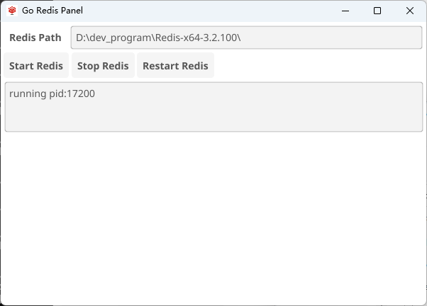

# Go Redis Panel

Go Redis Panel 是一个简单的图形用户界面应用程序，用于管理Redis服务的启动、停止和重启。这个程序是用Go语言编写的，并使用了Fyne库来创建GUI。

## 功能

- 启动Redis服务
- 停止Redis服务
- 重启Redis服务
- 显示运行中的Redis服务的进程ID

## 安装

要使用此程序，你需要在本地安装Go环境。请访问 [Go官方网站](https://golang.org) 获取安装指南。

一旦安装了Go，你可以通过以下命令克隆并构建项目：

```bash
git clone https://github.com/litongjava/go-redis-panel.git
cd go-redis-panel
go build -ldflags -H=windowsgui
```

这将生成一个没有控制台窗口的执行文件。

## 使用

启动程序后，你会看到一个窗口，其中包括：

- **Redis Path**: 输入框，用于指定Redis服务的安装路径。
- **Start Redis**: 按钮，点击以启动Redis服务。
- **Stop Redis**: 按钮，点击以停止当前运行的Redis服务。
- **Restart Redis**: 按钮，点击以重启Redis服务。

在启动或重启Redis服务时，底部的文本区域将显示服务的进程ID。

## 配置

如果需要配置Redis的特定参数，请在启动服务前直接修改你的Redis配置文件。

## 贡献

欢迎对项目做出贡献。请先Fork本仓库，然后创建你的分支，提交更改，并通过Pull Request提交给我们。

## 许可证

此项目使用 [MIT 许可证](LICENSE)。